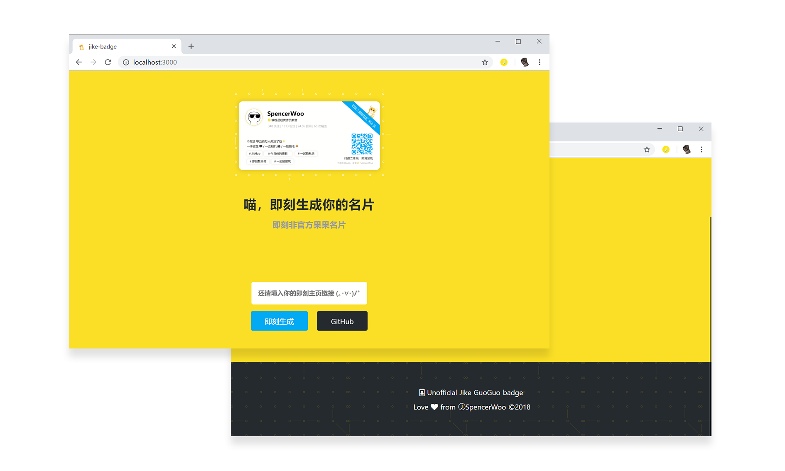

# 即刻非官方果果名片生成器


[](https://github.com/spencerwoo/jike-guoguo-badge)

[](https://github.com/spencerwooo/jike-guoguo-badge/blob/master/LICENSE)

> **Custom Jike name badge, meow.** 🐱

## Build Setup

``` bash
# install dependencies
$ yarn install

# serve with hot reload at localhost:3000
$ yarn run dev

# build for production and launch server
$ yarn run build
$ yarn start

# generate static project
$ yarn run generate
```

For detailed explanation on how things work, checkout [Nuxt.js docs](https://nuxtjs.org).

## Notice

主开发者常鸽，后端跑了，设计师是白嫖的，大家敬请期待。

---

💡 **Jike GuoGuo Name Badge** ©Spencer Woo. Released under the [MIT](https://github.com/spencerwooo/jike-guoguo-badge/blob/master/LICENSE) License. Name badge designs are released under the [CC BY-NC-SA 4.0 License.](https://creativecommons.org/licenses/by-nc-sa/4.0/)

Authored and maintained by Spencer Woo. Co-designed by [ⒿTH3EE](https://web.okjike.com/user/E0BBAACD-3991-49E3-916C-6A67430380A7).

[@Blog](https://spencerwoo.com/) · [ⒿJike](https://web.okjike.com/user/4DDA0425-FB41-4188-89E4-952CA15E3C5E/post) · [@GitHub](https://github.com/spencerwooo)